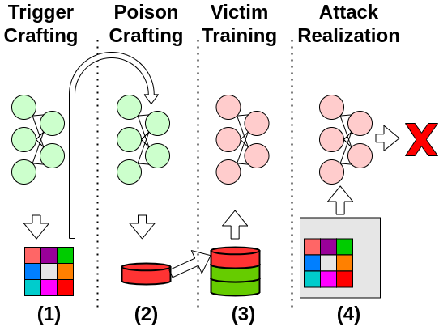

# Silent Killer

## Background
The project is the official implementation of the paper Silent Killer: Optimizing Backdoor Trigger Yields a Stealthy and Powerful Data Poisoning Attack.


## Requirements
All the requirements are listed in `requirements.txt`. \
We run this code with `python 3.8`. 
Run `pip install -r requirements.txt` to install requirements, and then run the script `silent_killer.py`.

## Run
### General
We demonstrate both attacks, perturbation as trigger and patch as trigger. \
The code implements the CIFAR-10 experiments.\

### Perturbation
To run our main attack: \
```python silent_killer.py --trigger_type additive --eps 0.062745```

To run the baseline (without poisoning): \
```python silent_killer.py --trigger_type additive --eps 0.062745 --n_samples 0 --crafting_repetitions 0```

### Patch
To run the optimized-patch: \
```python silent_killer.py --trigger_type adaptive_patch --eps 1```

To run the baseline (without trigger optimization): \
```python silent_killer.py --trigger_type adaptive_patch --eps 1 --trigger_opt false --trigger_init_method from_file```

### Important parameters
 - To specify source label and target label use `-s` and `-t` flags. 
 - To log results to wandb specify the entity, for example `--entity jhon`. 
The default project and run name are `silent-killer` and `base`. To change them use the flags `--project` and `--name`.
 - To use a pretrained model for crafting rather than retrain one from scratch in the beginning of the crafting 
use `--model_path`. Our checkpoints are available in 
[this link](https://drive.google.com/drive/folders/1u05sMn8yIjeTfWR6Q0q2hn72zdxGstIv?usp=sharing). 
please download them and write down the path to the checkpoint `--model_path /path/to/checkpoint.pt`.
Make sure that the checkpoint correspond to the model architecture defined in `--craft_model`.
 - The flag `--trigger_type` defines if the trigger will be a small perturbation over all the sample or a small patch. 
 - The flag `--trigger_opt` defines if the trigger will be optimized before the poison crafting (see the paper for more details).
 - The flag `--validation_frequency` defines the amount of times that the victim craft the poison on randomly initialized weights. 
The ASR will be averaged and reported as Mean ASR.

### Reproduction
In our experiments we run ResNet18 with default parameters, 
which means `--victim_lr 0.1 --victim_milestones 14, 24, 35 --victim_epochs 80`. 
MobileNet-V2 was trained with `--victim_lr 0.1 --victim_milestones 50 100 --victim_epochs 150`.
VGG11 was trained with `--victim_lr 0.01 --victim_milestones 14, 24, 35 --victim_epochs 80`. \
We average the results of the following (randomly chosen) pairs for evaluation:\
[(0, 1), (0, 3), (1, 6), (2, 0), (2, 1), (2, 7), (2, 9), (3, 2), (3, 7), (4, 1), (4, 2), (4, 6), (4, 9), (5, 2), (5, 3), 
(5, 6), (5, 9), (7, 2), (7, 9), (8, 2), (8, 4), (8, 6), (8, 9), (9, 7)] \ 
For black-box evaluation use different architectures in the parameters `--craft_model` and `--eval_model`. \
To evaluate defences, use `--apply_defences true` and choose the defence to apply (listed in `silent_killer.py`).